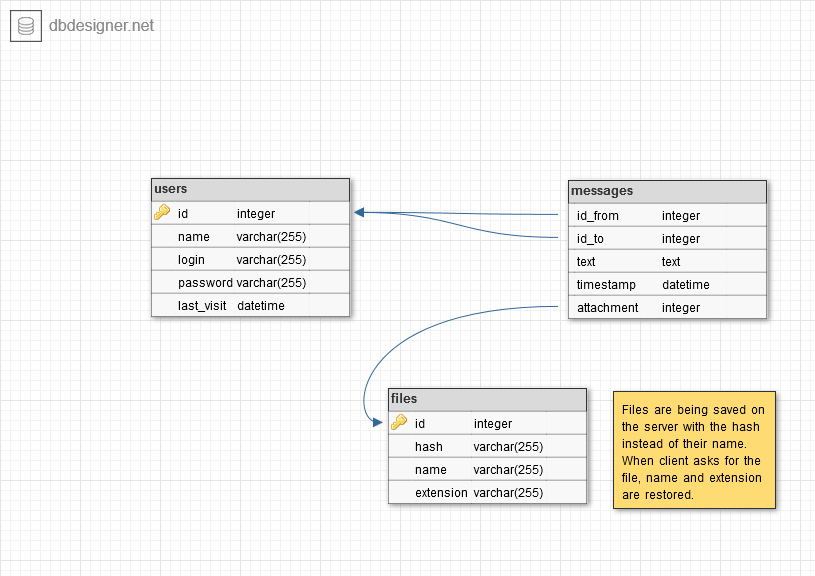
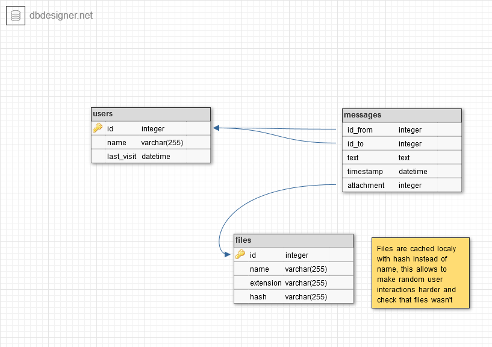

# JAM
Just Another Messenger is an our messenger attempt.

## Installation

TODO

## Usage

TODO

# Documentation

JAM consists of two sides: client and server.

## Server

Server side uses SQLite as a database to store info about users, messages and files.

  
DB schema for server side:

  

## Client
Client cashes all info in the local database, which is just little simplified version of the server one.

  
DB schema for client side:

  

